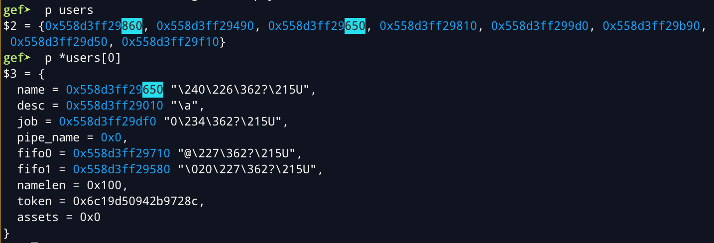

# final `Pwn` [50]

這題可以建立兩個 `animal`，並建立不限長度的 name。
`release` 有 UAF 問題，`play` 可以直接呼叫 function pointer。

## Leak Heap Base

先建立一個 name 長度為 0x20 的 animal，再將它 `release`。

此時 heap 上的 tcache 中會有兩個 0x30 的 chunk，tcache 中存放 next 和 key 的位置剛好是 animal 的 type，可以利用 `play` leak heap base。

## Leak Libc Base

由於這題可以自訂 name 的長度，將 name 的長度設為 0x410 時，會分配到 0x420 的 chunk，會直接進入 unsorted bin 不會進入 tcache。
若 freed chunk 相鄰 top chunk，會觸發 consolidate，不會進入 unsorted bin，需要在後面建立其他 chunk 避免觸發 consolidate。
在 unsorted bin 中的 chunk 會存放 fd 和 bk，從 main arena 指出來再指回去的 doubly circular linked list，一樣可以透過 `play` leak 資訊，算出 libc base。

## UAF overwrite function pointer

由於可控 allocate chunk 大小，可以使用 `change` 讓 name 使用到 `animals[0]` 的 chunk，直接修改 function pointer，最後再透過 `play` 即可觸發 `system("sh")`。

# easyheap `Pwn` [125]

這題可以建立 0x10 個 Book，也可以自訂 namelen 控制 chunk 大小。

## Leak Heap Base

先建立 8 個 namelen 為 0xb0 大小的 Book，再將它們 free，即可將 0xc0 大小的 chunk 放到 unsorted bin 中。
Book 結構中 name 的位置與 tcache 的 next 相同，透過 `list_book` 即可 leak heap base。

## Leak Libc Base

透過 allocate 大小為 0x110 的 chunk，即可將 unsorted bin 中 0xc0 的 chunk 放入 small bin 中，由於 small bin 的 fd / bk 會指向 chunk header，而且 small bin 中大小為 0xb0 的 chunk 為空，它們會指向 main arena 中自己 -0x10 的位置，可以 leak main arena，算出 libc base。

上圖中 0x30 的 chunk 皆為 Book，將 namelen 設成 0x20，即可拿到 0x30 的 chunk，讓 `books[9]->name` 和 `books[3]` 指向同一個 chunk，直接修改其他 Book 的內容，達成任意讀寫。

## Overwrite `__free_hook` to `system`

有了 libc base 即可算出 `__free_hook` 和 `system` 的位置，將 `__free_hook` 寫成 `system` ，再透過 `delete` 觸發 `system("sh")`。

# beeftalk `Pwn` [125]

這題最多可以建立 8 個 User，透過輸入不同長度的 name，可以控制 reallocate 的 chunk 大小。
`delete_account` 不會將 `users` 中的值清空，存在 UAF 漏洞。

## Leak Heap Base

`malloc` 從 tcache 中拿 chunk 時不會清空 next 的 pointer。
在 `signup` 中，name 是透過 `safe_read` 輸入，而不是 `read_str`，不會在字串結尾放入 null byte，可以 leak heap 上存的資訊。

## Leak Libc Base

若輸入 name 長度大於 0x20，會 reallocate 新的 chunk，name 最多可輸入 0x100 個 bytes；
還在 tcache 的範圍內，需要先填滿 tcache，接下來 free 的 chunk 才會進到 unsorted bin 中。

再 allocate 更大的 chunk，讓它們進入 small bins。

同時 `users[0]->desc` 會指向 `users[2]` ，由於 desc 和 User struct 的 chunk 大小相同，經過 `delete_account` 後，它們會進入 tcache，User struct 指向 desc 的 chunk，接下來就可以直接修改 struct 的內容，達成任意讀寫。

將 struct 中的  name 指向 small bin 中指向 main arena 的位置，可以 leak libc address。

## Overwrite `__free_hook` to `system`

有任意讀寫與 libc base，即可將 `__free_hook` 寫成 `system`，透過 `free_user` 觸發 `system("sh")`。

