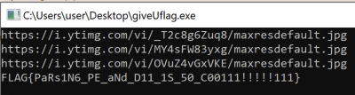

# giveUflag `Reverse` [250]

這是個 64-bits 的 exe 檔案。

```sh
$ file giveUflag.exe
giveUflag.exe: PE32+ executable (console) x86-64 (stripped to external PDB), for MS Windows
```

將程式丟進 ida 分析，`main` $(\text{0x401870})$ 呼叫了 `init` 和 `wrapper`。

```c
int __cdecl main(int argc, const char **argv, const char **envp) {
  init();
  wrapper();
  return 0;
}
```

`init` $(\text{0x401940})$，會從 `init_array`  $(\text{0x402FC0})$ 取出 function pointer 呼叫，並註冊 `fini` function。
`init_array` 只存在一個元素 $\text{0x402FB0}$ ，它會跳到 $\text{0x401530}$，註冊一個無用的 function 在程式結束時呼叫。

```c
void __fastcall init() {
  unsigned int i; // eax
  void (**func)(void); // rbx

  if ( !is_init ) {
    is_init = 1;
    i = (unsigned int)init_array[0];
    if ( init_array[0] == -1 )
      for ( i = 0; init_array[i + 1]; ++i )
        ;
    if ( i ) {
      func = (void (**)(void))&init_array[i];
      do
        (*func--)();
      while ( func != init_array );
    }
    register_onexit(fini);
  }
}
```

$\text{0x401510}$ 會使用 `onexit` 註冊程式結束時的 finish function，並回傳是否成功。

```c
int __fastcall register_onexit(_onexit_t func) {
  return -(onexit(func) == 0i64);
}
```

`fini` $(\text{0x401890})$ ，`fini_array` 是空的，不會執行任何 function。

```c
void fini(void) {
  void (*func)(void); // rax

  func = (void (*)(void))*point_to_fini_array;
  if ( *point_to_fini_array ) {
    do {
      func();
      func = (void (*)(void))++point_to_fini_array;
    }
    while ( func );
  }
}
```

`main` 裡呼叫的第二個函數 `wrapper` $(\text{0x40184C})$，它會找 kernel32.dll 的 base address 接著呼叫 `realmain`。

```c
void __fastcall wrapper() {
  char *dll_base; // [rsp+28h] [rbp-8h]

  dll_base = (char *)get_kernel32_dll_base();
  realmain(dll_base);
}
```

`get_kernel32_dll_base` $(\text{0x40184C})$ 透過 PEB 的 InMemoryOrderModuleList 找到 kernel32.dll 的 base address。

```c
void *__fastcall get_kernel32_dll_base() {
  _LIST_ENTRY *Flink; // [rsp+40h] [rbp-20h]
  _LIST_ENTRY *i; // [rsp+58h] [rbp-8h]

  Flink = NtCurrentPeb()->Ldr->InMemoryOrderModuleList.Flink;
  for ( i = Flink->Flink;
        i != Flink && wcsicmp((const wchar_t *)i[5].Flink, L"kernel32.dll");
        i = i->Flink )
    ;
  return i[2].Flink;
}
```

`realmain` $(\text{0x4015F3})$ 自己 parse PE format，找到 EAT，再找到 kernel32.dll 中的 `sleep` function。
分別 sleep 7days 後印出三張圖片的網站，最後再透過 xor 解密 flag 並輸出。

<div style="page-break-after: always;"></div>

```c
void __fastcall realmain(char *dll) {
  char flag[256]; // [rsp+20h] [rbp-60h] BYREF
  char key[192]; // [rsp+120h] [rbp+A0h] BYREF
  void (__fastcall *sleep_)(__int64); // [rsp+1E0h] [rbp+160h]
  void (__fastcall *sleep)(__int64); // [rsp+1E8h] [rbp+168h]
  char *str; // [rsp+1F0h] [rbp+170h]
  int *addr_of_names; // [rsp+1F8h] [rbp+178h]
  int *addr_of_funcs; // [rsp+200h] [rbp+180h]
  int n_of_funcs; // [rsp+20Ch] [rbp+18Ch]
  char *name; // [rsp+210h] [rbp+190h]
  int *exports; // [rsp+218h] [rbp+198h]
  int *NT_Hdr; // [rsp+220h] [rbp+1A0h]
  int j; // [rsp+228h] [rbp+1A8h]
  int i; // [rsp+22Ch] [rbp+1ACh]

  memcpy(key, &::key, 180ui64);
  memset(flag, 0, sizeof(flag));
  NT_Hdr = (int *)&dll[*((int *)dll + 15)];
  exports = (int *)&dll[NT_Hdr[34]];
  name = &dll[exports[3]];
  n_of_funcs = exports[5];
  addr_of_funcs = (int *)&dll[exports[7]];
  addr_of_names = (int *)&dll[exports[8]];
  for ( i = 0; i < n_of_funcs; ++i ) {
    str = &dll[addr_of_names[i]];
    if ( !stricmp(str, "sleep") )
      break;
  }
  sleep = (void (__fastcall *)(__int64))&dll[addr_of_funcs[i]];
  sleep_ = sleep;
  sleep(604800000i64);
  puts("https://i.ytimg.com/vi/_T2c8g6Zuq8/maxresdefault.jpg");
  sleep_(604800000i64);
  puts("https://i.ytimg.com/vi/MY4sFW83yxg/maxresdefault.jpg");
  sleep_(604800000i64);
  puts("https://i.ytimg.com/vi/OVuZ4vGxVKE/maxresdefault.jpg");
  for ( j = 0; j <= 44; ++j )
    flag[j] = secret[j] ^ key[4 * j];
  puts(flag);
}
```

將 `604800000` patch 成 0 即可拿到 flag。


