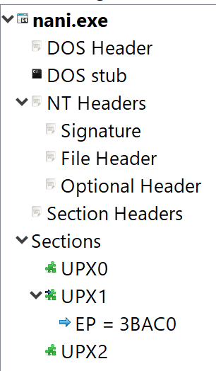
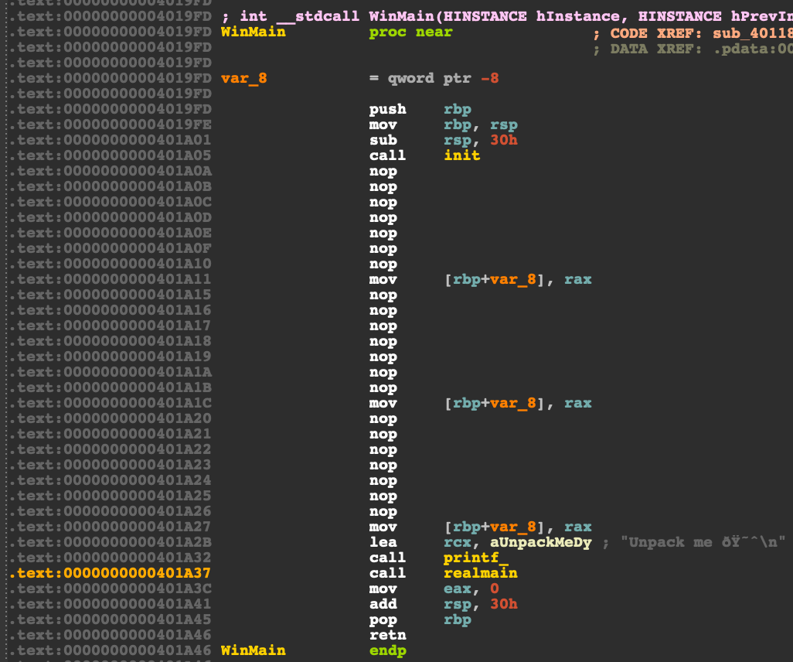
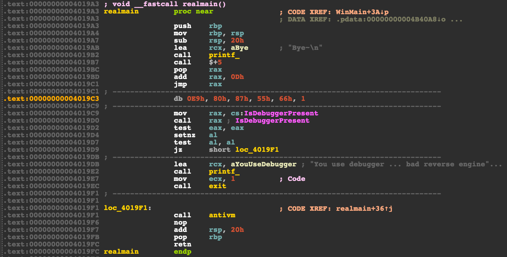
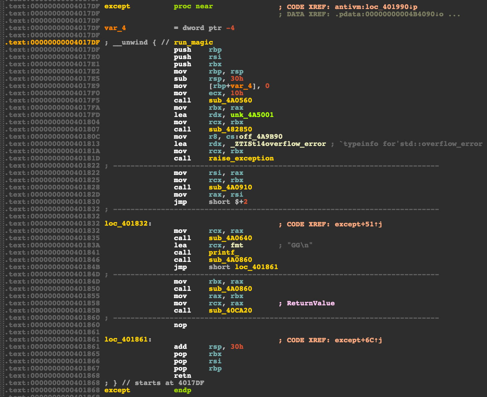
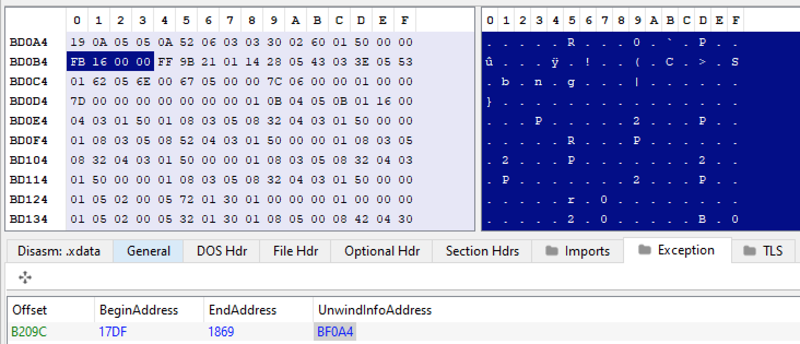

# nani `Reverse` [280]

將 nani.exe 放進 PE-bear 觀察，發現它經過 upx 加殼。



透過 `upx -t nani.exe` 確認它是 upx 殼，再透過 `upx -d -o real.exe nani.exe` 拿到原本的 binary。

```shell
$ upx -t nani.exe
                       Ultimate Packer for eXecutables
                          Copyright (C) 1996 - 2020
UPX 3.96        Markus Oberhumer, Laszlo Molnar & John Reiser   Jan 23rd 2020

testing nani.exe [OK]

Tested 1 file.

$ upx -d -o real.exe nani.exe
                       Ultimate Packer for eXecutables
                          Copyright (C) 1996 - 2020
UPX 3.96        Markus Oberhumer, Laszlo Molnar & John Reiser   Jan 23rd 2020

        File size         Ratio      Format      Name
   --------------------   ------   -----------   -----------
    840192 <-    245760   29.25%    win64/pe     real.exe

Unpacked 1 file.
```

<div style="page-break-after: always;"></div>

`WinMain`  $(\text{0x4019FD})$ 會呼叫 `init` 並輸出 `Unpack me`，再執行 `realmain`。



`realmain` $(\text{0x4019A3})$ 存在 anti-assembly 和 anti-debug，`jmp rax` 會跳到 $\text{0x4019BC} + \text{0xD} = \text{0x4019c9}$ ，並使用 `IsDebuggerPresent` 判斷是否正在被 debug。



<div style="page-break-after: always;"></div>

`antivm` $(\text{0x401869})$ 會透過 `cpuid` 判斷是否在 vm 裡面，如果不在這 6 種 vm 裡面就會呼叫 `except`。

```c
__int64 antivm() {
  int is_in_vm; // eax
  char *VMs[6]; // [rsp+20h] [rbp-90h]
  char CPU[64]; // [rsp+50h] [rbp-60h] BYREF
  int v9; // [rsp+90h] [rbp-20h]
  _DWORD v10[3]; // [rsp+94h] [rbp-1Ch] BYREF
  unsigned __int16 sz; // [rsp+A2h] [rbp-Eh]
  BOOL v12; // [rsp+A4h] [rbp-Ch]
  int v13; // [rsp+A8h] [rbp-8h]
  int i; // [rsp+ACh] [rbp-4h]

  v9 = -1;
  v13 = 0x40000000;
  v12 = 0;
  VMs[0] = "KVMKVMKVM";
  VMs[1] = "Microsoft Hv";
  VMs[2] = "VMwareVMware";
  VMs[3] = "XenVMMXenVMM";
  VMs[4] = "prl hyperv  ";
  VMs[5] = "VBoxVBoxVBox";
  sz = 6;
  _RAX = 0x40000000i64;
  __asm { cpuid }
  v10[0] = _RBX;
  v10[1] = _RCX;
  v10[2] = _RDX;
  memset(CPU, 0, sizeof(CPU));
  memcpy(CPU, v10, 12ui64);
  for ( i = 0; ; ++i )
  {
    if ( i >= sz )
      except();
    is_in_vm = strcmp(CPU, VMs[i]);
    v12 = is_in_vm == 0;
    if ( !is_in_vm )
      break;
  }
  printf_("[!] %s\n", CPU);
  printf_("You use VM ... bad reverse engineer :(((\n");
  return 1i64;
}
```

<div style="page-break-after: always;"></div>

`except` $(\text{0x4017DF})$ 會觸發 exception，透過 Exception Directory 可以找到 exception handler 的 RVA $(\text{0x16FB})$。





<div style="page-break-after: always;"></div>

`run_magic` $(\text{0x4016FB})$ 會將 `magic` $(\text{0x4015AF})$ 後 256 bytes xor 0x87，接著執行 `magic`。

```c
__int64 __fastcall run_magic(struct _EXCEPTION_RECORD *ExceptionRecord, void *EstablisherFrame, struct _CONTEXT *ContextRecord, void *DispatcherContext) {
  DWORD flOldProtect; // [rsp+28h] [rbp-18h]
  int sz; // [rsp+2Ch] [rbp-14h]
  char *ptr; // [rsp+30h] [rbp-10h]
  int i; // [rsp+3Ch] [rbp-4h]

  ptr = magic;
  sz = 256;
  if ( VirtualProtect(nullsub_1, 0x1000ui64, PAGE_EXECUTE_READWRITE, &flOldProtect) == 0 )
    exit(1);
  for ( i = 0; i < sz; ++i )
    ptr[i] ^= 0x87u;
  if ( VirtualProtect(nullsub_1, 0x1000ui64, PAGE_EXECUTE_READ, &flOldProtect) == 0 )
    exit(1);
  ContextRecord->Rip = (DWORD64)magic;
  return 0i64;
}
```

<div style="page-break-after: always;"></div>

`magic` $(\text{0x4015AF})$ 解密後的 function 如下，flag 就是 xor 後產生的字串。

```c
void __noreturn magic()
{
  char flag[256]; // [rsp+20h] [rbp-60h]
  int enc[20]; // [rsp+120h] [rbp+A0h]
  int n; // [rsp+178h] [rbp+F8h]
  int i; // [rsp+17Ch] [rbp+FCh]

  enc[0] = 232;
  enc[1] = 226;
  enc[2] = 239;
  enc[3] = 233;
  enc[4] = 213;
  enc[5] = 220;
  enc[6] = 157;
  enc[7] = 216;
  enc[8] = 157;
  enc[9] = 220;
  enc[10] = 221;
  enc[11] = 157;
  enc[12] = 241;
  enc[13] = 227;
  enc[14] = 207;
  enc[15] = 155;
  enc[16] = 250;
  enc[17] = 157;
  enc[18] = 252;
  enc[19] = 211;
  n = 174;
  for ( i = 0; (unsigned __int64)i <= 19; ++i )
    flag[i] = n ^ LOBYTE(enc[i]);
  flag[i] = 0;
  sub_4015A4(flag);
  exit(1);
}
```

FLAG: `FLAG{r3v3rs3_Ma5T3R}`