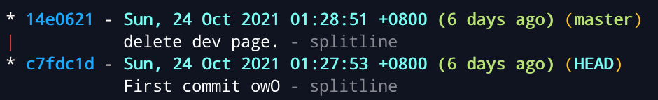

# Imgura `Web` [100]

題目的 hint 給 Information Leak ，發現網站存在 `/.git` 目錄。
透過 [GoGitDumper](https://github.com/C-Sto/GoGitDumper) 下載 git objects。

在 git history 中，可以發現 `/dev_test_page` 的 source code。
Code review 後，發現 `index.php` 存在 LFI 漏洞、`upload.php` 可以上傳檔案。

透過 `upload.php` 上傳檔案需要通過許多限制。

- 將 webshell 塞在圖片的 exif 中
- 利用 [php short echo tag](https://www.php.net/manual/en/language.basic-syntax.phptags.php) 
- 檔名為 `meow.png.php` 

利用以上三點即可成功上傳檔案，並透過 LFI 達成 RCE。

> 由於沒有設定 `/dev_test_page/images` 下的檔案不可執行 php，直接存取檔案也可以 RCE。

# DVD Screensaver `Web` [200]

`/login` route 會將使用者輸入直接放入 SQL statement 查詢，但輸入僅限於 `^[0-9a-zA-Z]+$` ，無法利用。
`/` route 會將 session 中的 username 放入 SQL statement 查詢，取得 `SECRET_KEY` 後自行偽造 session 即可觸發 SQLi。

`/static/` route 的 `filepath.Join("./static/", filename)` 存在任意讀檔漏洞。
但 golang 的 http server 預設會 normalize path，使用 `CONNECT` method 則不會（[docs](https://pkg.go.dev/net/http#ServeMux.Handler)、[source]([go/server.go at 13eccaa9902f3bb17999f1f7f14b7da39d60e0ea · golang/go (github.com)](https://github.com/golang/go/blob/13eccaa9902f3bb17999f1f7f14b7da39d60e0ea/src/net/http/server.go#L2400))）。
利用此漏洞讀取 `/proc/self/environ` ，取得 `SECRET_KEY`。

研究 [gorilla/sessions](https://github.com/gorilla/sessions) 的 source code，自行偽造 session（詳見 `forge-cookie/app.go`），觸發 SQLi。
透過 `flag like 'FLAG{%}'` 找出真正的 flag。