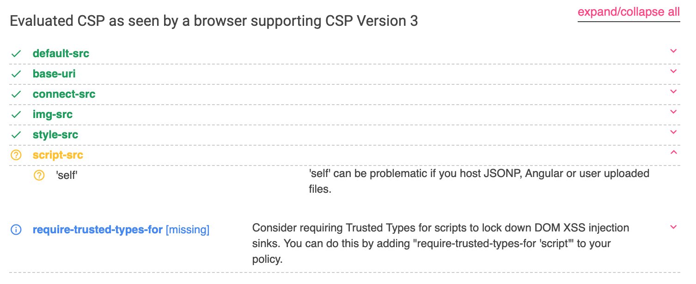
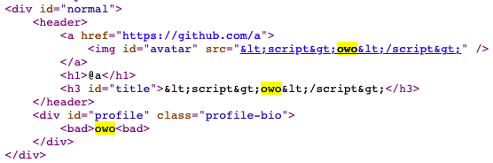
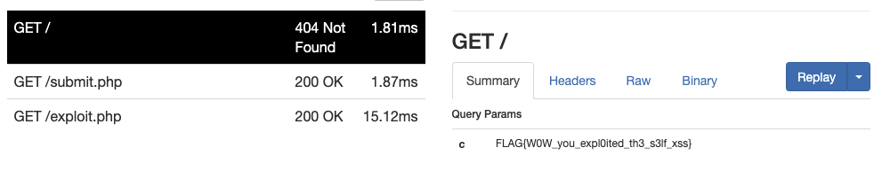
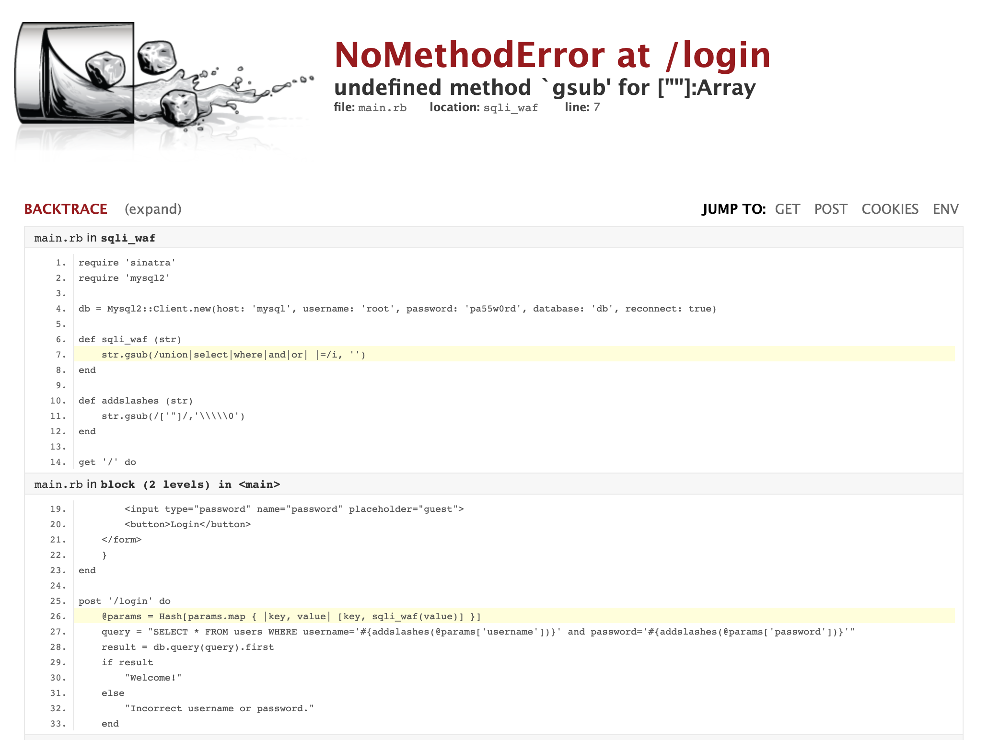

# Profile Card `Web` [300]

## Recon

使用隨意帳號密碼登入後，可以看到許多選單。

- `Edit` 可以編輯個人資料
- `Reset` 可以重設個人資料
- `Export as html` 會將個人資料以 HTML 格式渲染，並設定 Content-Disposition 下載檔案
- `Export as markdown` 會將個人資料以 markdown 格式渲染，並設定 Content-Disposition 下載檔案
-  `FLAG` 是 admin only 的頁面
- `Report to Admin` 可以送出任意 URL 給 admin，有上 pow 防護

## CSP

Header 中有設定 Content-Security-Policy，透過 CSP Evaluator 分析可以發現 `script-src: 'self'` 搭配 `Export as ...` 可以達成 xss。



## Include script

在 `Edit` 的三個欄位都輸入 `<script>owo</script>`，發現 avatar 和 title 欄位的內容會被經過 HTML Entities Encode 後渲染到 HTML 中，bio 的內容會被經過 markdown 渲染成 HTML 後顯示在畫面上，但 `<script>` 和 `</script>` 會被替換成 `<bad>`。



在 iframe 的 srcdoc 屬性中，可以使用 HTML Entities Encode 後的 HTML 渲染資訊，bypass `<script>` 被置換成 `<bad>` 的限制。

## Upload payload to markdown

在  `Export as markdown` 中會以下方方式渲染（`{...}` 是可控範圍），而且不會經過任何 encode 和 filter。
在 avatar 中塞入 `( alert(1) ))]/*`，在 bio 塞入 `*/` ，可以讓它成為合法的 JavaScript 並執行。

```markdown
[](https://github.com/{username})

# @{username}

### {title}

---

{bio}
```

## Submit to admin

`/api/update` 的 endpoint 是透過 json 的方式更新資料，透過 HTML form 和 `enctype="text/plain"` 可以跨網站帶 cookie 送出資料。

在 selenium 中，可以開啟多個 tab，先送出 HTML form 再瀏覽網頁。
綜合以上，使用 ngrok 讓 xss bot 可以瀏覽惡意網頁並回傳 flag。



# Double SSTI `Web` [150]

在 `/source/` 有 source code，需要在 handlebars 中 SSTI 獲得 secret，拿到 proxy 的 path，接下來在 Jinja 中 SSTI RCE 拿到 flag。

## handlebars

express 可以接受 query 是陣列，使用 `['{{ secret }}', 'owo']` 即可繞過 includes 的檢查，compile 的時候會自動講陣列轉成字串（`{{ secret }},owo`），即可拿到 secret。

## Jinja

透過黑箱測試，發現 post 的 name 不能含有 `__`, `[`, `]`, `.`。

- `'__globals__'` 可以將 `__` 替換成 ` \x5f\x5f` 繞過限制。
- `A.B` 可以透過 jinja builtin filter 中的 `attr` 繞過限制，`A|attr('B')`。
- `dict['key']` 可以使用 `__getitem__` 結合  `attr` 繞過限制，`dict|attr('__getitem__')('key')`。

flask 在 jinja 中塞入了許多預設的 object，在 `url_for` 中可以找到 os module，達成 RCE。

# Log me in: FINAL `Web` [200]

## Recon

透過 Chrome Dev Tools 將 HTML form 中的 `name="username"` 改成 `name="username[]"` ，觸發 error 得到 source code。



## Code Review

- sqli_waf 會將 `union`, `select`, `where`, `and`, `or`, ` `, `=` 移除，但只會移除一次，將字串重複插在中間（`ununionion`）即可 bypass keyword，註解（ `/**/` ）可以當成空白使用。
- addslashes 會在 `'` 和 `"` 前面加上反斜線，輸入 `\'` 可以讓加入的反斜線失效，閉合單引號執行 SQLi。
- SQL query 結束後，只會用有無回傳值回傳不同結果，明顯是 blind-based SQLi，
  但此網站有開啟 `show_exceptions` 設定，可以使用 error-based SQLi。

## Exploit

在 `username` 欄位輸入 `\' #`  可以閉合單引號並註解後面的語法，在中間插入 SQLi payload。
由於無法使用 `=` ，透過 `column in (char(X,X,X))` 繞過限制。

### Blind-based SQLi

使用 MySQL 的 substr function，分別取出每一個字元，再用二分搜找到是哪一個字元。

### Error-based SQLI

使用 MySQL 的 ST_LatFromGeoHash function，若參數不是 geohash_str，則會以 error 的方式將參數印出來。
